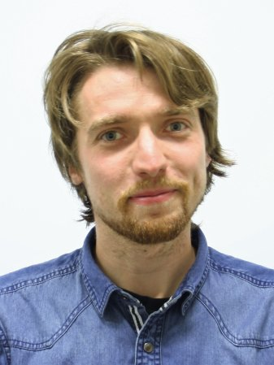

#### Bio
Gust Bilcke is a PhD student in Biology whose main focus is the physiology and transcriptomics of mating in marine diatoms (algae). Gust combines wetlab research with omics data analysis at StatOmics. Currently, he is working on a challenging dataset comparing two mating types ("sexes") of the diatom Seminavis robusta.
