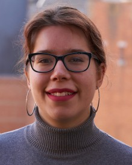

#### Bio

I did my master thesis in Biomedical Sciences at UGent, where I carried out a combination of both wetlab experiments and computational coding in the field of cell migration. I’m extending cell migration analysis software with data analysis and mining strategies to understand cell migration plasticity and heterogeneity.
